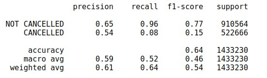
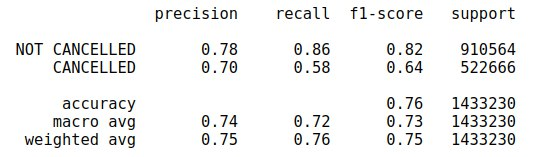

# Flight Delay Predicting

The data is taken from DOT's Bureau of Transportation Statistics, available here https://www.kaggle.com/usdot/flight-delays, which encompasses all the domestic US flights from 2015, with information about the airline company, the plane used, the time of departure, and whether the flight was delayed or not.

With this information, we want to be able to predict whether a flight will be delayed or not and before that, do some data analysis.

## Interesting information.

The dataset is quite big, with 5.8 million entries. It occupies 1.3GB of memory once loaded as a pandas dataframe. 
The full analysis is on the Jupyter notebook. This is but a glimpse.

### What percentage of flights got delayed?

### What airlines had the most percentage of flights delayed?

### At what departure time are delays more likely?

### How many minutes do flights usually get delayed?

## Predicting.

### Linear regression

The recall for the delay flights was awful, at just 8%. While it's 96% for non cancelled flights, this is useless. The model is just comfortably classifying almost all flights as non delayed. This result is not very helpful.

### Random Forest Tree

Using a Random Forest Tree with 15 estimators, we get a much better result, with 58% of delayed flights being properly predicted, and 86% for non cancelled. Meaning that this classifier makes a very educated guess, catching 58% of all delayed flights, and not overpredicting, since 70% of the flights it predicts as delayed will actually be delayed. 

## Conclusion

Much better results could be had with further information, specially if we had some sort of weather prediction information. But for this to work properly, we would need to work near the dates of the flight to have a good predictor. Other more subtle parameters could be added to the mix, but for this we would need more information that's not available to the public.

For people with this information and a much higher computing power, I assume a great accuracy could be reach when predicting delays in flight that could help solve the problem if seriously taken.

