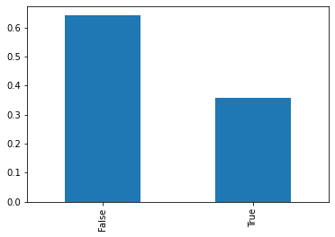
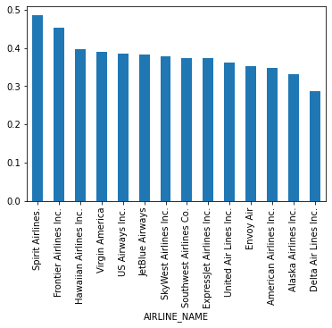
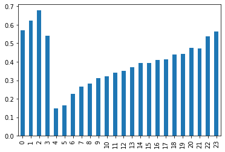
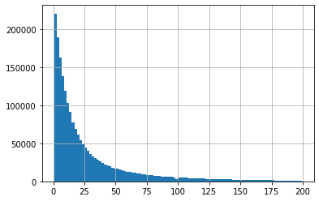

# Flight Delay Predicting

The data is taken from DOT's Bureau of Transportation Statistics, available here https://www.kaggle.com/usdot/flight-delays, which encompasses all the domestic US flights from 2015, with information about the airline company, the plane used, the time of departure, and whether the flight was delayed or not.

With this information, we want to be able to predict whether a flight will be delayed or not and before that, do some data analysis.

## Interesting information.

The dataset is quite big, with 5.8 million entries. It occupies 1.3GB of memory once loaded as a pandas dataframe. The full analysis is on the Jupyter notebook. This is a glimpse.

### What percentage of flights got delayed?

### What airlines had the most percentage of flights delayed?

### At what departure time are delays more likely?

### How many minutes do flights usually get delayed?

